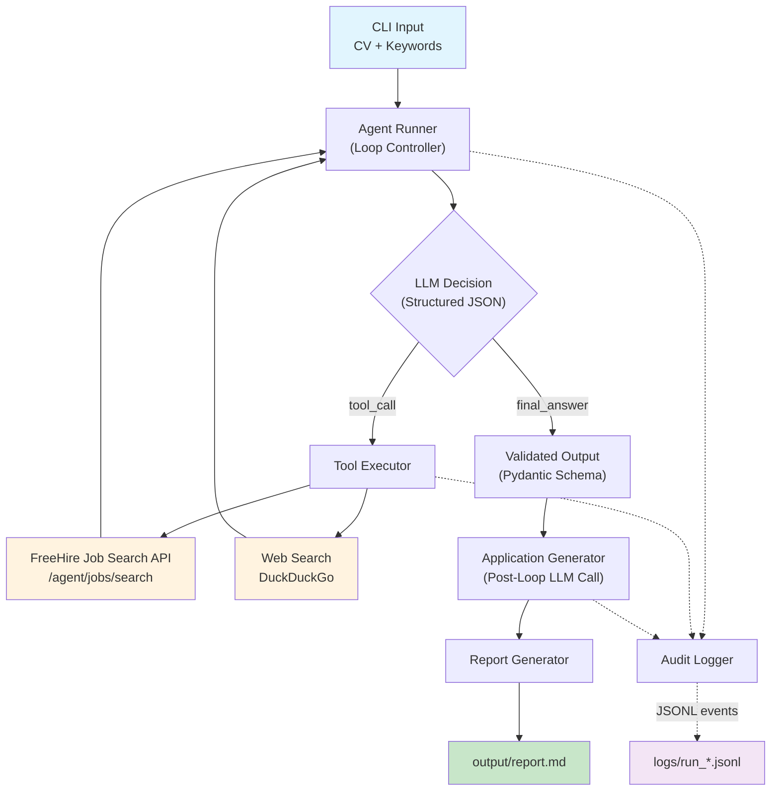

# Job Hunter Agent

[](https://www.python.org/)
[](https://platform.openai.com/)
[](#)

An observable agentic workflow that automates job research, CV matching, and tailored application drafting. Built in 7 days as a portfolio prototype to demonstrate reliable, tool-using AI agents with full execution transparency.

---

## 🎯 What This Project Does

Given a CV and a set of job search keywords, the agent:

1. **Searches** for matching roles using the [FreeHire](https://freehire.me) jobs API.
2. **Researches** the most promising companies using web search.
3. **Compares** job descriptions against the candidate's CV with cited evidence.
4. **Generates** tailored CV bullets and cover letters for each selected role.
5. **Produces** a consolidated Markdown report ready for application.

Every decision, tool call, and error is captured in a structured JSONL audit trail. Nothing is hidden.

---

## 📐 Architecture



The agent operates in a strict loop:

```text
prompt → model → structured JSON → tool call or final answer → repeat
```

After the loop completes, a focused post-loop LLM call generates application materials for each selected job. These are compiled into a single consolidated Markdown report.

The loop stops when:
- the model returns a valid `final_answer`, or
- the `max_steps` limit is reached, or
- a guardrail forces termination.

---

## 📦 Output

The agent produces a single consolidated Markdown report in `output/` containing:

- Match analysis with cited CV evidence for each role
- Tailored CV bullets rewritten for each specific job
- Full cover letters addressed appropriately (including recruitment agency detection)
- Company research summaries with sources
- Recommended next steps

---

## 🗓️ Development Progress

| Day | Scope | Status |
|-----|-------|--------|
| 1 | Agent loop, structured JSON output, max-step limit, OpenAI integration | ✅ Complete |
| 2 | Tool use: FreeHire job search API + DuckDuckGo web search | ✅ Complete |
| 3 | Guardrails: geography default, job freshness, evidence-based matching, research budget, defensive JSON parsing | ✅ Complete |
| 4 | Context & memory: tiktoken counting, context window pruning at 30k tokens | ✅ Complete |
| 5 | Audit trail: JSONL event logging, trace viewer CLI | ✅ Complete |
| 6 | Real workflow: tailored CV bullets, cover letters, consolidated Markdown report | ✅ Complete |
| 7 | Checkpoint: validation, portfolio packaging, limitations, next iteration | ✅ Complete |

---

## ⚙️ Setup

### Prerequisites

- Python 3.10 or higher
- An OpenAI API key with billing enabled
- Internet access (for FreeHire API and web search)

### Installation

```bash
git clone https://github.com/YOUR_USERNAME/job-hunter-agent.git
cd job-hunter-agent

python -m venv .venv
source .venv/bin/activate        # macOS / Linux
# .venv\Scripts\Activate.ps1     # Windows PowerShell

pip install -e .

cp .env.example .env
```

Then edit `.env` and add your OpenAI API key.

---

### 🔑 OpenAI API Key Setup

This project calls the OpenAI API programmatically. A browser-based ChatGPT subscription does **not** provide API access.

1. **Sign in** at [platform.openai.com](https://platform.openai.com/)
2. **Add billing** under `Settings → Billing` and purchase a small credit balance
3. **Set a usage limit** — recommended: soft limit `$5`, hard limit `$10`
4. **Create an API key** under `API Keys`, name it `job-hunter-agent-dev`
5. **Copy the key** into your `.env` file

Verify everything works:

```bash
python -m job_agent.check_openai
```

---

### 🌐 FreeHire API Configuration

This project uses the dedicated agent endpoint:

```text
GET https://freehire.me/api/v1/agent/jobs/search
```

This endpoint returns full job descriptions in Markdown format, which is significantly better for LLM consumption than the standard truncated preview. No authentication is required.

The `.env` file is pre-configured with sensible defaults:

```env
FREEHIRE_SEARCH_URL=https://freehire.me/api/v1/agent/jobs/search
FREEHIRE_DESCRIPTION_FORMAT=markdown
```

---

### 📋 Environment Variables

| Variable | Required | Default | Description |
|----------|----------|---------|-------------|
| `OPENAI_API_KEY` | Yes | — | Your OpenAI secret API key |
| `OPENAI_MODEL` | No | `gpt-4o-mini` | Model used for agent reasoning |
| `FREEHIRE_SEARCH_URL` | No | `https://freehire.me/api/v1/agent/jobs/search` | FreeHire agent search endpoint |
| `FREEHIRE_DESCRIPTION_FORMAT` | No | `markdown` | Job description format |

---

## 📄 CV Files

This project uses two CV files to separate real personal data from the public repository:

| File | Purpose | Committed? |
|------|---------|------------|
| `private/alexandre_cv.md` | Real CV for actual agent runs | ❌ No (gitignored) |
| `examples/dummy_cv.md` | Sanitized CV for demos and contributors | ✅ Yes |

Run against your real CV locally:

```bash
python -m job_agent.main --cv private/alexandre_cv.md --keywords examples/keywords.json
```

Run against the safe demo CV:

```bash
python -m job_agent.main --cv examples/dummy_cv.md --keywords examples/keywords.json
```

---

## 🚀 Running the Agent

### 1. Verify OpenAI Setup

```bash
python -m job_agent.check_openai
```

### 2. Test Tools Independently

```bash
# Job search (defaults to UK region, last 30 days)
python -m job_agent.tools --keywords Python "Software Engineer"

# Job search with filters
python -m job_agent.tools --keywords Python "Backend Engineer" --remote

# Company research with industry context
python -m job_agent.tools --company "Worldpay" --context "fintech payments"
```

### 3. Run the Full Agent

```bash
python -m job_agent.main \
  --cv private/alexandre_cv.md \
  --keywords examples/keywords.json \
  --max-steps 8
```

### 4. View the Audit Trail

```bash
# List all runs
python -m job_agent.view_trace --list

# View a specific run
python -m job_agent.view_trace --file logs/run_20260907_135609_06876e8d.jsonl
```

### 5. Read the Generated Report

```bash
cat output/job_application_report_*.md
```

---

## 🛡️ Guardrails

| Guardrail | Layer | Description |
|-----------|-------|-------------|
| Input validation | Code | Rejects empty or too-short CVs, empty keyword lists |
| Max-step limit | Code | Hard stop at `max_steps` (default 8) |
| Geography default | Tool | Auto-defaults to `regions=uk` if LLM omits it |
| Job freshness | Tool | `posted_within_days=30` filters stale listings |
| Research budget | Code | Hard cap of 2 `research_company` calls per run |
| Contextual research | Tool | Appends industry context to prevent wrong-company matches |
| Evidence-based matching | Schema | `cv_evidence` field forces LLM to cite specific CV content |
| Defensive JSON parsing | Code | Auto-unwraps `[{...}]` → `{...}` in tool arguments |
| JSON repair loop | Prompt | Feeds parse errors back to LLM for self-correction |
| Context pruning | Code | Compresses history when token count exceeds 30k |
| Output schema enforcement | Code | Pydantic validation on every LLM response |
| Recruitment agency detection | Prompt | Cover letters addressed to consultant, not agency |

---

## 🔍 FreeHire API Notes

### Key Parameters

| Parameter | Type | Description |
|-----------|------|-------------|
| `q` | string | Full-text search over title, company, and description |
| `limit` | integer | Page size, 1–100 |
| `description_format` | string | `html`, `text`, or `markdown` |
| `work_mode` | string | `remote`, `hybrid`, `onsite` |
| `seniority` | string | `intern`, `junior`, `middle`, `senior`, `lead`, `staff`, `principal` |
| `regions` | string | `global`, `north_america`, `latam`, `eu`, `uk`, etc. |
| `posted_within_days` | integer | Only return jobs posted in the last N days |

### Agent Endpoint vs Standard Endpoint

| Feature | `/jobs/search` | `/agent/jobs/search` |
|---------|---------------|----------------------|
| Description length | Truncated preview | Full verbatim text |
| Format options | No | `html`, `text`, `markdown` |
| Intended consumer | Web UI | Programmatic / AI agents |

This project uses the agent endpoint exclusively.

---

## 📁 Project Structure

```text
job-hunter-agent/
├── .env                              # Local secrets (gitignored)
├── .env.example                    # Template for environment variables
├── .gitignore                      # Excludes secrets, logs, output, private data
├── README.md                       # This file
├── pyproject.toml                  # Project metadata and dependencies
├── examples/
│   ├── dummy_cv.md                 # Sanitized CV (safe for GitHub)
│   └── keywords.json              # Target job search keywords
├── logs/                           # JSONL audit trails (gitignored)
│   └── run_*.jsonl
├── output/                         # Generated reports (gitignored)
│   └── job_application_report_*.md
├── private/                        # Real CV and personal data (gitignored)
│   └── alexandre_cv.md
└── src/
    └── job_agent/
        ├── __init__.py
        ├── agent_runner.py         # Core agent loop, guardrails, post-loop generation
        ├── application_generator.py # Tailored CV bullets + cover letter generation
        ├── audit_logger.py         # JSONL structured event logging
        ├── check_openai.py         # OpenAI API connectivity checker
        ├── llm_client.py           # Centralized OpenAI wrapper
        ├── main.py                 # CLI entrypoint
        ├── models.py              # Pydantic schemas and state models
        ├── prompts.py             # System prompts and prompt builders
        ├── report_generator.py    # Consolidated Markdown report writer
        ├── tools.py               # FreeHire API + DuckDuckGo web search
        └── view_trace.py          # Audit trail viewer CLI
```

---

## 🧪 Troubleshooting

### `Missing OPENAI_API_KEY`

Your `.env` file is missing or incomplete. Ensure `.env` exists in the project root and contains `OPENAI_API_KEY=sk-...`.

### `401 Unauthorized` from OpenAI

Your API key is invalid. Check that the key was copied correctly and billing is enabled.

### `429 Too Many Requests` from OpenAI

Insufficient billing balance, rate limit reached, or usage limit reached. Check the [OpenAI billing dashboard](https://platform.openai.com/settings/organization/billing).

### `requires a different Python`

The project requires Python 3.10+. Check with `python --version`.

### FreeHire returns zero jobs

The search terms may be too narrow. Try `python -m job_agent.tools --keywords Python` as a baseline.

### DuckDuckGo search fails

DuckDuckGo occasionally rate-limits automated requests. The tool returns a structured error rather than crashing. Wait a minute and retry.

---

## 🔒 Security Notes

- **Never commit `.env`** — blocked by `.gitignore`
- **Never commit your real CV** — keep it in `private/` which is gitignored
- **Never commit audit logs** — they contain CV text, blocked by `.gitignore`
- **Never commit generated reports** — they contain personal details, blocked by `.gitignore`
- **Set usage limits** in the OpenAI dashboard to prevent runaway costs
- **Use `gpt-4o-mini`** during development to keep token costs low

---

## 🚧 Known Limitations

These are honest, deliberate scope boundaries — not bugs.

| Limitation | Why | Mitigation Path |
|-----------|-----|-----------------|
| Recruitment agencies are researched, not end-clients | FreeHire lists the posting agency as the company | Day 6 prompt instructs the LLM to detect agencies and address the end-client. A future iteration could parse the job description to extract the real company name. |
| No expired job validation | Job boards use Cloudflare bot protection that blocks automated HEAD requests | FreeHire's `posted_within_days` filter reduces stale results at the source. A future iteration could use a headless browser for validation. |
| Single LLM provider | OpenAI only | The architecture centralises all LLM calls behind `llm_client.py`. Swapping providers requires changing one file. |
| No retry logic for transient API failures | Week 1 scope | The agent receives structured errors and decides whether to retry or stop. A future iteration could add exponential backoff. |
| No evaluation harness | Week 1 scope | A future iteration would add a test suite with known-good inputs and expected output ranges. |
| Cover letters are drafts, not final | LLM-generated text requires human review | The report is explicitly framed as a starting point. Every letter should be reviewed before sending. |
| No multi-run memory | Each run is independent | A future iteration could store past applications in SQLite to avoid duplicate research. |

---

## 🔮 Next Iteration Roadmap

If this project continued into Week 2, the priorities would be:

1. **Evaluation harness** — Define 5 known-good input/output pairs and run them automatically to catch regressions.
2. **End-client extraction** — Parse job descriptions to identify the actual hiring company when the listing is from a recruitment agency.
3. **Multi-run memory** — SQLite store of past applications to avoid re-researching the same companies.
4. **Human-in-the-loop approval** — Pause before generating cover letters so the candidate can approve the selected jobs.
5. **PDF export** — Convert the Markdown report to a formatted PDF with proper letter formatting.
6. **Cost tracking** — Log actual token usage and API costs per run in the audit trail.
7. **Provider abstraction** — Support Anthropic Claude and local models through a common interface.

---

## 🛠️ Built With

- [OpenAI API](https://platform.openai.com/) — LLM reasoning and structured output
- [FreeHire API](https://freehire.me/docs/api) — Job search with full descriptions
- [DuckDuckGo Search](https://pypi.org/project/ddgs/) — Company research
- [Pydantic](https://docs.pydantic.dev/) — Input/output validation
- [Rich](https://rich.readthedocs.io/) — Console output formatting
- [tiktoken](https://github.com/openai/tiktoken) — Token counting for context management

---

## 📝 License

This project is a personal portfolio prototype. Not intended for production use.
