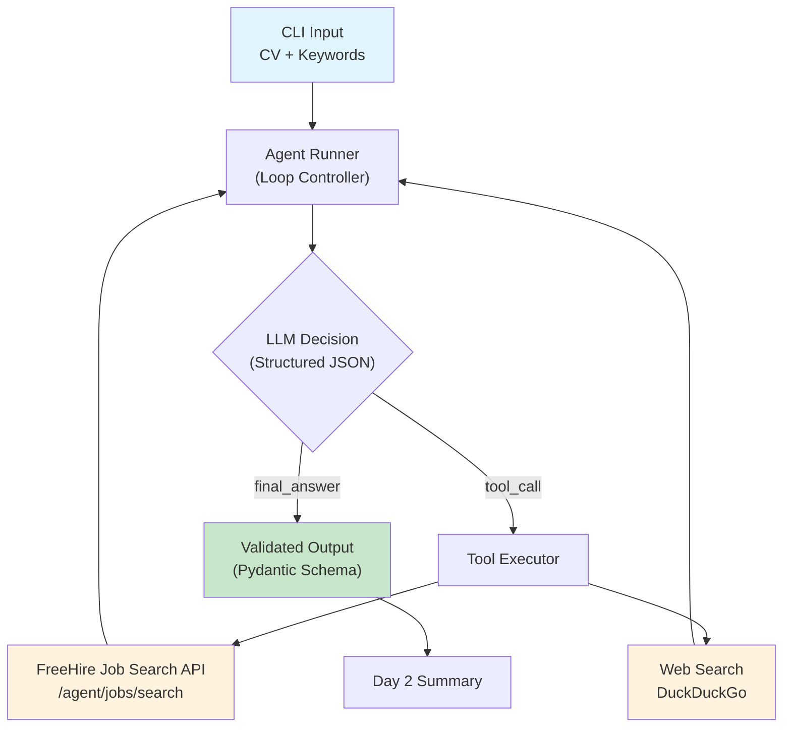

# Job Hunter Agent

[](https://www.python.org/)
[](https://platform.openai.com/)
[](#)

An observable agentic workflow that automates job research, CV matching, and application drafting. Built as a Week 1 portfolio prototype to demonstrate reliable, tool-using AI agents with full execution transparency.

---

## 🎯 What This Project Does

Given a CV and a set of job search keywords, the agent:

1. **Searches** for matching roles using the [FreeHire](https://freehire.me) jobs API.
2. **Researches** the most promising companies using web search.
3. **Compares** job descriptions against the candidate's CV.
4. **Explains** why each role is a good match.
5. **Produces** a structured summary with tailored application guidance.

Every decision, tool call, and error is visible in the console trace. Nothing is hidden.

---

## 📐 Architecture



The agent operates in a strict loop:

```text
prompt → model → structured JSON → tool call or final answer → repeat
```

It stops when:
- the model returns a valid `final_answer`, or
- the `max_steps` limit is reached.

---

## 📦 Output Strategy

To keep the prototype lean and focused, the final Day 7 output will be a **single consolidated Markdown report** saved to `output/`.

The report will contain:
- matched companies and roles,
- match reasoning for each,
- tailored CV highlights,
- cover letter drafts.

This approach keeps debugging simple and avoids premature file-management complexity.

---

## 🗓️ Development Progress

| Day | Scope | Status |
|-----|-------|--------|
| 1 | Agent loop, structured JSON output, max-step limit, OpenAI integration | ✅ Complete |
| 2 | Tool use: FreeHire job search API + DuckDuckGo web search | ✅ Complete |
| 3 | Guardrails: input validation, output filtering, rate limits | 🔲 Pending |
| 4 | Context & memory: context window management, deliberate persistence | 🔲 Pending |
| 5 | Audit trail: full JSONL execution logging with trace viewer | 🔲 Pending |
| 6 | Real workflow: end-to-end job application prep | 🔲 Pending |
| 7 | Checkpoint: demo, polish, portfolio packaging | 🔲 Pending |

---

## ⚙️ Setup

### Prerequisites

- Python 3.10 or higher
- An OpenAI API key with billing enabled
- Internet access (for FreeHire API and web search)

### Installation

```bash
# Clone the repository
git clone https://github.com/YOUR_USERNAME/job-hunter-agent.git
cd job-hunter-agent

# Create and activate a virtual environment
python -m venv .venv
source .venv/bin/activate        # macOS / Linux
# .venv\Scripts\Activate.ps1     # Windows PowerShell

# Install the project in editable mode
pip install -e .

# Create your environment file
cp .env.example .env
```

Then edit `.env` and add your OpenAI API key.

---

### 🔑 OpenAI API Key Setup

This project calls the OpenAI API programmatically. A browser-based ChatGPT subscription does **not** provide API access.

1. **Sign in** at [platform.openai.com](https://platform.openai.com/)
2. **Add billing** under `Settings → Billing` and purchase a small credit balance
3. **Set a usage limit** — recommended: soft limit `$5`, hard limit `$10`
4. **Create an API key** under `API Keys`, name it `job-hunter-agent-dev`
5. **Copy the key** into your `.env` file

Verify everything works:

```bash
python -m job_agent.check_openai
```

Expected output:

```text
✓ API key accepted by OpenAI models.list().
Chat completion succeeded. Model replied: 'ok'
```

---

### 🌐 FreeHire API Configuration

This project uses the **dedicated agent endpoint** provided by FreeHire:

```text
GET https://freehire.me/api/v1/agent/jobs/search
```

This endpoint returns **full job descriptions in Markdown format**, which is significantly better for LLM consumption than the standard truncated preview.

No authentication is required. All parameters are passed as query strings.

The `.env` file is pre-configured with sensible defaults:

```env
FREEHIRE_SEARCH_URL=https://freehire.me/api/v1/agent/jobs/search
FREEHIRE_DESCRIPTION_FORMAT=markdown
```

---

### 📋 Environment Variables Reference

| Variable | Required | Default | Description |
|----------|----------|---------|-------------|
| `OPENAI_API_KEY` | Yes | — | Your OpenAI secret API key |
| `OPENAI_MODEL` | No | `gpt-4o-mini` | Model used for agent reasoning |
| `FREEHIRE_SEARCH_URL` | No | `https://freehire.me/api/v1/agent/jobs/search` | FreeHire agent search endpoint |
| `FREEHIRE_DESCRIPTION_FORMAT` | No | `markdown` | Job description format (`html`, `text`, `markdown`) |

---

## 📄 CV Files

This project uses two CV files to separate real personal data from the public repository:

| File | Purpose | Committed to GitHub? |
|------|---------|----------------------|
| `private/alexandre_cv.md` | Real CV for actual agent runs | ❌ No (gitignored) |
| `examples/dummy_cv.md` | Sanitized CV for demos and contributors | ✅ Yes |

Run against your real CV locally:

```bash
python -m job_agent.main --cv private/alexandre_cv.md --keywords examples/keywords.json
```

Run against the safe demo CV:

```bash
python -m job_agent.main --cv examples/dummy_cv.md --keywords examples/keywords.json
```

> **Never commit real personal data.** The `private/` directory is excluded from version control by `.gitignore`.

---

## 🚀 Running the Agent

### 1. Verify OpenAI Setup

```bash
python -m job_agent.check_openai
```

### 2. Test Tools Independently (Day 2)

Test the FreeHire job search tool directly:

```bash
# Basic search
python -m job_agent.tools --keywords Python "Software Engineer"

# Search for remote roles only
python -m job_agent.tools --keywords Python "Backend Engineer" --remote

# Test company research
python -m job_agent.tools --company "Worldpay"

# Test both at once
python -m job_agent.tools --keywords Java "Spring Boot" --company "Sicredi"
```

### 3. Run the Full Agent

```bash
python -m job_agent.main \
  --cv private/alexandre_cv.md \
  --keywords examples/keywords.json \
  --max-steps 8
```

The agent will:
1. Load your CV and keywords.
2. Call `search_freehire_jobs` to find matching roles.
3. Review results and select the most promising companies.
4. Call `research_company` for external context.
5. Produce a structured Day 2 summary.

---

## 🔍 FreeHire API Notes

Discovered during Day 2 implementation by reviewing the [FreeHire API documentation](https://freehire.me/docs/api).

### Key Parameters

| Parameter | Type | Description |
|-----------|------|-------------|
| `q` | string | Full-text search over title, company, and description |
| `limit` | integer | Page size, 1–100 |
| `description_format` | string | `html` (default), `text`, or `markdown` |
| `sort` | string | `created_at`, `posted_at`, `salary_min`, `salary_max` |
| `order` | string | `asc` or `desc` (default) |
| `work_mode` | string | `remote`, `hybrid`, `onsite` |
| `seniority` | string | `intern`, `junior`, `middle`, `senior`, `lead`, `staff`, `principal` |
| `regions` | string | `global`, `north_america`, `latam`, `eu`, `uk`, etc. |
| `skills` | string | Comma-separated skill tags, supports `_mode=and` and `_exclude` |

### Agent Endpoint vs Standard Endpoint

| Feature | `/jobs/search` | `/agent/jobs/search` |
|---------|---------------|----------------------|
| Description length | Truncated preview | **Full verbatim text** |
| Format options | No | `html`, `text`, `markdown` |
| Intended consumer | Web UI | **Programmatic / AI agents** |

This project uses the agent endpoint exclusively.

---

## 📁 Project Structure

```text
job-hunter-agent/
├── .env                          # Local secrets (gitignored)
├── .env.example                # Template for environment variables
├── .gitignore                  # Excludes secrets and private data
├── README.md                   # This file
├── pyproject.toml              # Project metadata and dependencies
├── examples/
│   ├── dummy_cv.md             # Sanitized CV (safe for GitHub)
│   └── keywords.json           # Target job search keywords
├── private/                    # Real CV and personal data (gitignored)
│   └── alexandre_cv.md
└── src/
    └── job_agent/
        ├── __init__.py
        ├── agent_runner.py     # Core agent loop and tool execution
        ├── check_openai.py     # OpenAI API connectivity checker
        ├── llm_client.py       # Centralized OpenAI wrapper
        ├── main.py             # CLI entrypoint
        ├── models.py           # Pydantic schemas and state models
        ├── prompts.py          # System prompts and prompt builders
        └── tools.py            # FreeHire API + web search tools
```

---

## 🧪 Troubleshooting

### `Missing OPENAI_API_KEY`

Your `.env` file is missing or incomplete. Make sure:
- `.env` exists in the project root,
- it contains `OPENAI_API_KEY=sk-...`,
- you are running commands from the project root.

### `401 Unauthorized` from OpenAI

Your API key is invalid. Check:
- the key was copied correctly (no extra spaces),
- the key has not been revoked,
- billing is enabled on your OpenAI account.

### `429 Too Many Requests` from OpenAI

Usually one of:
- insufficient billing balance,
- rate limit reached,
- usage limit reached.

Check the [OpenAI billing dashboard](https://platform.openai.com/settings/organization/billing).

### `requires a different Python`

Your Python version is below 3.10. Check with:

```bash
python --version
```

The project requires Python 3.10+.

### FreeHire returns zero jobs

Verify the search terms are not too narrow. Try:

```bash
python -m job_agent.tools --keywords Python
```

If that works but your keywords don't, the query may be too specific. The `q` parameter does full-text search across title, company, and description.

### DuckDuckGo search fails

DuckDuckGo occasionally rate-limits automated requests. The tool will return a structured error rather than crashing. Wait a minute and retry, or reduce `max_results`.

---

## 🔒 Security Notes

Because this is a public portfolio repository:

- **Never commit `.env`** — it is blocked by `.gitignore`
- **Never commit your real CV** — keep it in `private/` which is gitignored
- **Never hardcode API keys** in source code
- **Set usage limits** in the OpenAI dashboard to prevent runaway costs
- **Use `gpt-4o-mini`** during development to keep token costs low

If you accidentally commit a secret, revoke it immediately in the OpenAI dashboard and rotate it.

---

## 🚧 Current Limitations

- **No guardrails beyond basic validation.** Day 3 will add stricter input filtering, output schema enforcement, and tool call limits.
- **No persistent audit trail.** Console output only. Day 5 will add JSONL logging with a trace viewer.
- **No tailored CV or cover letter generation.** Day 6 will add full application document drafting.
- **No Markdown report output.** Day 7 will produce the final consolidated report in `output/`.
- **Single LLM provider.** OpenAI only. The architecture is designed to be provider-agnostic, but no abstraction layer exists yet.
- **No retry logic for transient failures.** If a tool call fails, the agent receives the error and decides what to do.

---

## 🛠️ Built With

- [OpenAI API](https://platform.openai.com/) — LLM reasoning and structured output
- [FreeHire API](https://freehire.me/docs/api) — Job search with full descriptions
- [DuckDuckGo Search](https://pypi.org/project/duckduckgo-search/) — Company research
- [Pydantic](https://docs.pydantic.dev/) — Input/output validation
- [Rich](https://rich.readthedocs.io/) — Console output formatting

---

## 📝 License

This project is a personal portfolio prototype. Not intended for production use.