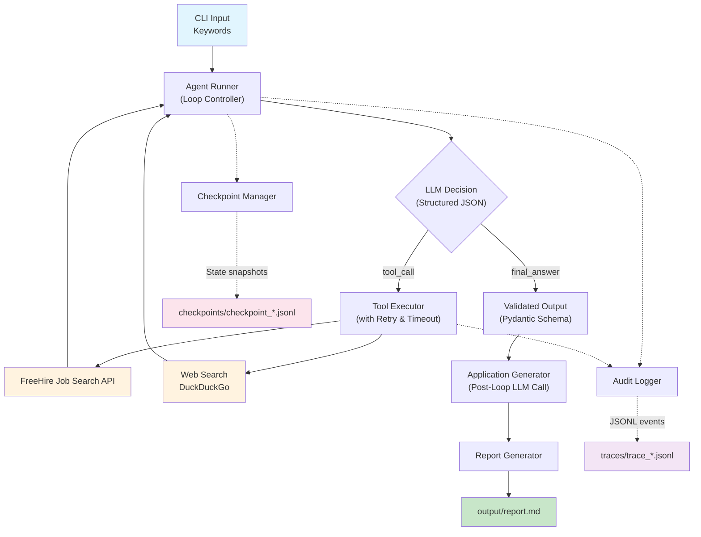

# Job Hunter Agent

An observable, resilient agentic workflow that automates job research, CV matching, and tailored application drafting. Built over 14 days as a portfolio prototype to demonstrate reliable, tool-using AI agents with full execution transparency, crash recovery, and partial completion guarantees.

---

## 🎯 What This Project Does

Given a set of job search keywords, the agent:

1. **Searches** for matching roles using the [FreeHire](https://freehire.me) jobs API.
2. **Researches** the most promising companies using web search.
3. **Generates** tailored CV bullets and cover letters for each selected role.
4. **Produces** a consolidated Markdown report ready for application.
5. **Survives failures**: If the agent crashes or a specific job fails, it checkpoints its state, resumes cleanly, and delivers partial results for all successfully processed jobs.

Every decision, tool call, retry, and error is captured in a structured JSONL audit trail. Nothing is hidden.

---

## 📐 Architecture

The agent operates in a strict loop with built-in resilience:
- **Retry & Backoff**: Transient failures (timeouts, 503s) trigger bounded exponential backoff (max 3 attempts).
- **Timeouts**: All external calls have hard time limits enforced via centralized config.
- **Checkpointing**: State is persisted to JSONL after every job, enabling crash recovery.
- **Partial Completion**: If a job fails permanently, it is logged, and the agent continues to the next job.

---

## 📦 Output

The agent produces a single consolidated Markdown report in `reports/` containing:

- Match analysis with cited CV evidence for each role
- Tailored CV bullets rewritten for each specific job
- Full cover letters addressed appropriately (including recruitment agency detection)
- A "Failed Jobs" section detailing any roles that could not be processed and why

---

## 🗓️ Development Progress

| Day | Scope | Status |
|-----|-------|--------|
| 1 | Agent loop, structured JSON output, max-step limit, OpenAI integration | ✅ Complete |
| 2 | Tool use: FreeHire job search API + DuckDuckGo web search | ✅ Complete |
| 3 | Guardrails: geography default, job freshness, evidence-based matching, research budget | ✅ Complete |
| 4 | Context & memory: tiktoken counting, context window pruning | ✅ Complete |
| 5 | Audit trail: JSONL event logging, trace viewer CLI | ✅ Complete |
| 6 | Real workflow: tailored CV bullets, cover letters, consolidated Markdown report | ✅ Complete |
| 7 | Checkpoint: validation, portfolio packaging, limitations, next iteration | ✅ Complete |
| 8 | **Failure taxonomy**: 8 error categories, exception classification | ✅ Complete |
| 9 | **Resilience**: Retry with exponential backoff (bounded to 3 attempts) | ✅ Complete |
| 10 | **Reliability**: Timeout enforcement on all external API calls | ✅ Complete |
| 11 | **Persistence**: JSONL checkpointing after every job step | ✅ Complete |
| 12 | **Recovery**: Robust resume with state validation and interrupted run detection | ✅ Complete |
| 13 | **Partial completion**: Delivers results even if individual jobs fail, tracks failures | ✅ Complete |
| 14 | **Checkpoint**: End-to-end recovery demo, progress documentation | ✅ Complete |

---

## ⚙️ Setup

### Prerequisites

- Python 3.10 or higher
- An OpenAI API key with billing enabled
- Internet access (for FreeHire API and web search)

### Installation

    git clone https://github.com/mateador/job-hunter-agent.git
    cd job-hunter-agent

    python -m venv .venv
    source .venv/bin/activate        # macOS / Linux
    # .venv\Scripts\Activate.ps1     # Windows PowerShell

    pip install -e .

    cp .env.example .env

Then edit `.env` and add your OpenAI API key.

### 🔑 OpenAI API Key Setup

1. **Sign in** at [platform.openai.com](https://platform.openai.com/)
2. **Add billing** under `Settings → Billing` and purchase a small credit balance
3. **Set a usage limit** — recommended: soft limit `$5`, hard limit `$10`
4. **Create an API key** under `API Keys`, name it `job-hunter-agent-dev`
5. **Copy the key** into your `.env` file

Verify everything works:

    python -m src.job_agent.check_openai

---

## 🚀 Running the Agent

### 1. Run the Full Agent

    python -m src.job_agent.main "python engineer london" --max-jobs 5

### 2. View the Audit Trail

    # View the most recent trace as a human-readable narrative
    python -m src.job_agent.view_trace --narrative

### 3. Manage Interrupted Runs

    # List any runs that were interrupted and can be resumed
    python -m src.job_agent.main --list-interrupted

    # Resume a specific run
    python -m src.job_agent.main "python engineer london" --resume --run-id <RUN_ID>

    # Resume from a specific checkpoint ID
    python -m src.job_agent.main "python engineer london" --resume-from 2 --run-id <RUN_ID>

### 4. Read the Generated Report

    cat reports/report_*.md

---

## 📁 Project Structure

    job-hunter-agent/
    ├── docs/
    │   ├── FAILURE_TAXONOMY.md       # Day 8: Failure categories and mitigation
    │   └── PROGRESS.md               # Day 14: Checkpoint progress report
    ├── scripts/
    │   └── demo_recovery.sh          # Day 14: Manual recovery demonstration script
    ├── tests/                        # Day 9-14: Comprehensive test suite (31+ tests)
    │   ├── test_retry.py
    │   ├── test_timeouts.py
    │   ├── test_checkpoint.py
    │   ├── test_resume.py
    │   ├── test_partial_completion.py
    │   └── test_recovery_demo.py
    ├── src/
    │   └── job_agent/
    │       ├── config.py             # Day 10: Centralized timeout configuration
    │       ├── failures.py           # Day 8: Exception hierarchy and classification
    │       ├── retry.py              # Day 9: Reusable exponential backoff wrapper
    │       ├── checkpoint.py         # Day 11-12: State persistence and resume logic
    │       ├── agent_runner.py       # Core agent loop with partial completion
    │       ├── application_generator.py # Tailored CV bullets + cover letter generation
    │       ├── audit_logger.py       # JSONL structured event logging
    │       ├── llm_client.py         # Centralized OpenAI wrapper with timeout
    │       ├── main.py               # CLI entrypoint with resume flags
    │       ├── models.py             # Pydantic schemas and state models
    │       ├── prompts.py            # System prompts and prompt builders
    │       ├── report_generator.py   # Consolidated Markdown report writer
    │       ├── tools.py              # FreeHire API + DuckDuckGo web search
    │       └── view_trace.py         # Audit trail viewer CLI
    ├── .env.example                  # Template for environment variables
    ├── pyproject.toml                # Project metadata and dependencies
    └── README.md                     # This file

---

## 🛡️ Guardrails & Resilience

| Feature | Layer | Description |
|---------|-------|-------------|
| **Input validation** | Code | Rejects empty or malformed queries |
| **Max-step limit** | Code | Hard stop at `max_steps` to prevent infinite loops |
| **Geography default** | Tool | Auto-defaults to `regions=uk` if LLM omits it |
| **Job freshness** | Tool | `posted_within_days=30` filters stale listings |
| **Context pruning** | Code | Compresses history when token count exceeds limits |
| **Output schema enforcement** | Code | Pydantic validation on every LLM response |
| **Recruitment agency detection** | Prompt | Cover letters addressed to consultant, not agency |
| **Bounded retry** | Code | Exponential backoff (1s, 2s, 4s) capped at 3 attempts |
| **Timeout enforcement** | Code | Hard limits on all external API calls (LLM: 60s, FreeHire: 15s, DDG: 10s) |
| **Checkpointing** | Code | State persisted to JSONL after every job step |
| **Partial completion** | Code | Agent continues processing if individual jobs fail |

---

## 🧪 Testing

The project includes a comprehensive test suite covering retry logic, timeout classification, checkpoint save/load, resume scenarios, partial completion, and full end-to-end recovery cycles.

    # Run all tests
    pytest tests/ -v

    # Run the end-to-end recovery demo (shows kill/resume cycle)
    pytest tests/test_recovery_demo.py -v -s

---

## 🚧 Known Limitations

These are honest, deliberate scope boundaries — not bugs.

| Limitation | Why | Mitigation Path |
|-----------|-----|-----------------|
| **No evaluation harness yet** | Week 1-2 focused on core resilience | Planned for Week 3: Golden dataset + automated scoring |
| **No cost tracking yet** | Week 1-2 focused on resilience | Planned for Week 3: Token usage logging and model routing |
| **Recruitment agencies are researched, not end-clients** | FreeHire lists the posting agency as the company | Day 6 prompt instructs the LLM to detect agencies. Future: parse description to extract real company. |
| **Single LLM provider** | OpenAI only for now | Architecture centralises all LLM calls behind `llm_client.py`. Swapping providers requires changing one file. |
| **Cover letters are drafts, not final** | LLM-generated text requires human review | The report is explicitly framed as a starting point. Every letter should be reviewed before sending. |

---

## 🔮 Next Iteration Roadmap (Week 3)

1. **Evaluation harness** — Define 20 known-good input/output pairs and run them automatically to score correctness, format, and tool selection.
2. **Cost measurement & model routing** — Log token usage per run and route simple tasks to cheaper models.
3. **Failure mode documentation** — Document known failure frequencies and mitigation strategies based on real run data.
4. **End-client extraction** — Parse job descriptions to identify the actual hiring company when the listing is from a recruitment agency.
5. **Human-in-the-loop approval** — Pause before generating cover letters so the candidate can approve the selected jobs.

---

## 🛠️ Built With

- [OpenAI API](https://platform.openai.com/) — LLM reasoning and structured output
- [FreeHire API](https://freehire.me/docs/api) — Job search with full descriptions
- [DuckDuckGo Search](https://pypi.org/project/ddgs/) — Company research
- [Pydantic](https://docs.pydantic.dev/) — Input/output validation
- [Rich](https://rich.readthedocs.io/) — Console output formatting
- [tiktoken](https://github.com/openai/tiktoken) — Token counting for context management
- [pytest](https://docs.pytest.org/) — Comprehensive test suite

---

## 📝 License

This project is a personal portfolio prototype demonstrating Forward Deployed Software Engineering practices. Not intended for production use without further evaluation and security review.
