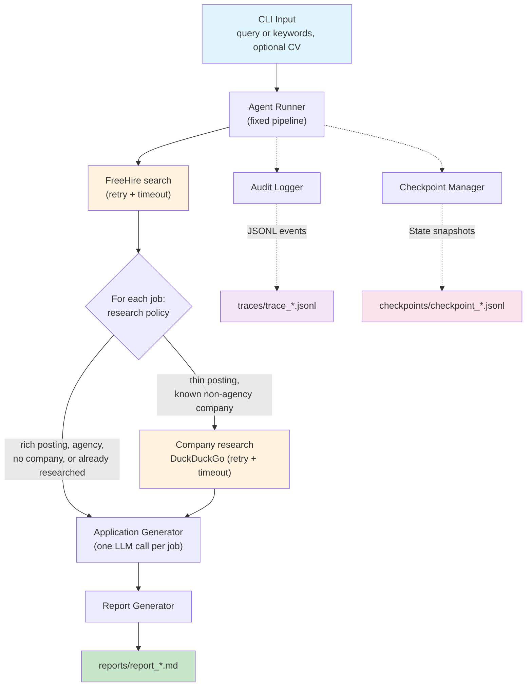

# Job Hunter Agent

An observable, resilient agentic workflow that automates job research, CV matching, and tailored application drafting. Built as a 30-day portfolio case study (currently at Day 18) to demonstrate reliable AI workflows with full execution transparency, crash recovery, partial completion guarantees, and measurable evaluation.

---

## 🎯 What This Project Does

Given a search query (or a list of keyword queries) and optionally your CV, the agent:

1. **Searches** for matching roles using the [FreeHire](https://freehire.me) jobs API (UK, last 30 days).
2. **Escalates to company research** via web search (DuckDuckGo) only for jobs whose posting is too thin to write from. Agencies, jobs without a company name, and companies already researched in the run are skipped.
3. **Generates** tailored CV bullets and a cover letter for every job returned (up to `--max-jobs`).
4. **Produces** a consolidated Markdown report with a summary, each application, and any failed jobs.
5. **Survives failures**: If the agent crashes or a specific job fails, it checkpoints its state, resumes cleanly, and delivers partial results for all successfully processed jobs.

Every decision, tool call, retry, and error is captured in a structured JSONL audit trail. Nothing is hidden.

---

## 📐 Architecture

```mermaid
graph TD
    A["CLI Input<br/>query or keywords, optional CV"] --> B["Agent Runner<br/>(fixed pipeline)"]
    B --> F["FreeHire search<br/>(retry + timeout)"]
    F --> P{"For each job:<br/>research policy"}
    P -->|"thin posting,<br/>known non-agency company"| G["Company research<br/>DuckDuckGo (retry + timeout)"]
    P -->|"rich posting, agency,<br/>no company, or already researched"| H
    G --> H["Application Generator<br/>(one LLM call per job)"]
    H --> I["Report Generator"]
    I --> J["reports/report_*.md"]

    K["Audit Logger"] -.->|"JSONL events"| L["traces/trace_*.jsonl"]
    M["Checkpoint Manager"] -.->|"State snapshots"| N["checkpoints/checkpoint_*.jsonl"]

    B -.-> K
    B -.-> M

    style A fill:#e1f5fe
    style J fill:#c8e6c9
    style F fill:#fff3e0
    style G fill:#fff3e0
    style L fill:#f3e5f5
    style N fill:#fce4ec
```

The agent is a fixed pipeline, not an LLM-driven loop: it runs one search, then makes one pass over the jobs. The LLM writes the applications but does not choose tools. When to research is decided by a deterministic, testable rule (`research_policy.py`): a posting under 600 characters from a known non-agency company is researched; anything else is not. Research is optional, so if it fails the letter is written without it and the job still completes.

Resilience features:
- **Retry & Backoff**: Transient failures (timeouts, 503s) trigger bounded exponential backoff (max 3 attempts, 1s then 2s between them).
- **Timeouts**: All external calls have hard time limits enforced via centralized config.
- **Checkpointing**: State is persisted to JSONL after every job, enabling crash recovery.
- **Partial Completion**: If a job fails permanently, it is logged, and the agent continues to the next job.

---

## 📦 Output

The agent produces a single consolidated Markdown report in `reports/` containing:

- A header with query, status, jobs found, applications generated and the checkpoint file
- For each job: title, company, location, URL, the full cover letter and the tailored CV bullets
- A "Failed Jobs" section detailing any roles that could not be processed, with the error category
- A closing summary of the run

Cover letters for recruitment agencies are addressed to the consultant rather than the agency. This is an instruction in the generation prompt, not separate logic, so it is not guaranteed.

---

## 🗓️ Development Progress

| Day | Scope | Status |
|-----|-------|--------|
| 1 | Agent loop, structured JSON output, max-step limit, OpenAI integration | ⚠️ Superseded: the LLM-driven loop was replaced by a fixed pipeline in Day 11 |
| 2 | FreeHire job search API integration | ✅ Complete (endpoint corrected on Day 16) |
| 3 | DuckDuckGo search tool; guardrails (geography default, job freshness) | ⚠️ Partly superseded: `regions=uk` and `posted_within_days=30` remain in the search; the evidence-matching and research-budget guardrails and the search tool's use in the loop were removed in Day 11. Research was reconnected on Day 18 |
| 4 | Context & memory: tiktoken counting, context window pruning | ⚠️ Superseded: removed in Day 11 (`tiktoken` is still listed as a dependency but unused) |
| 5 | Audit trail: JSONL event logging, trace viewer CLI | ✅ Complete |
| 6 | Real workflow: tailored CV bullets, cover letters, consolidated Markdown report | ✅ Complete |
| 7 | Checkpoint: validation, portfolio packaging, limitations, next iteration | ✅ Complete |
| 8 | **Failure taxonomy**: 8 error categories, exception classification | ✅ Complete |
| 9 | **Resilience**: Retry with exponential backoff (bounded to 3 attempts) | ✅ Complete |
| 10 | **Reliability**: Timeout enforcement on all external API calls | ✅ Complete |
| 11 | **Persistence**: JSONL checkpointing after every job step | ✅ Complete |
| 12 | **Recovery**: Robust resume with state validation and interrupted run detection | ✅ Complete |
| 13 | **Partial completion**: Delivers results even if individual jobs fail, tracks failures | ✅ Complete |
| 14 | **Checkpoint**: End-to-end recovery demo, progress documentation | ✅ Complete |
| 15 | **Golden dataset**: 20 queries across 5 categories; `--cv` and `--keywords` restored | ✅ Complete |
| 16 | **Eval harness**: mock and live runs, scoring, reports; fixed FreeHire search (it was ignoring the query); blank-query rejection | ✅ Complete |
| 17 | **Correctness & format evals**: per-application format, addressing and number-grounding checks | ✅ Complete |
| 18 | **Tool selection & escalation**: rule-based DuckDuckGo research, hand-labelled scenarios | ✅ Complete |
| 19 | **Cost & routing**: token usage and estimated cost per call/run, model router with a separate grounding-retry model, model comparison tool | ✅ Complete (defaults unchanged until the comparison supports a change) |
| 20-28 | Failure modes, eval report, case study documents | ⏳ Planned |

---

## ⚙️ Setup

### Prerequisites

- Python 3.10 or higher
- An OpenAI API key with billing enabled
- Internet access (for FreeHire API and web search)

### Installation

    git clone https://github.com/mateador/job-hunter-agent.git
    cd job-hunter-agent

    python -m venv .venv
    source .venv/bin/activate        # macOS / Linux
    # .venv\Scripts\Activate.ps1     # Windows PowerShell

    pip install -e .
    pip install pytest               # for the test suite

    cp .env.example .env

Then edit `.env` and add your OpenAI API key.

### 🔑 OpenAI API Key Setup

1. **Sign in** at [platform.openai.com](https://platform.openai.com/)
2. **Add billing** under `Settings → Billing` and purchase a small credit balance
3. **Set a usage limit** — recommended: soft limit `$5`, hard limit `$10`
4. **Create an API key** under `API Keys`, name it `job-hunter-agent-dev`
5. **Copy the key** into your `.env` file

Verify everything works:

    python -m src.job_agent.check_openai

---

## 🚀 Running the Agent

### 1. Run the Full Agent

    python -m src.job_agent.main "python engineer london" --max-jobs 5

    # Tailored to your CV (kept in the gitignored private/ folder)
    python -m src.job_agent.main "Forward Deployed Engineer" --cv private/my_cv.md --max-jobs 3

    # Several queries from a JSON file
    python -m src.job_agent.main --keywords examples/keywords.json --cv private/my_cv.md

    # Use a different model for grounding retries (default: same as --model)
    python -m src.job_agent.main "python engineer london" --model gpt-4o-mini --retry-model <stronger-model>

Each run prints its token usage and estimated cost, and the report's summary repeats it.

### 2. View the Audit Trail

    # View the most recent trace as a human-readable narrative
    python -m src.job_agent.view_trace --narrative

### 3. Manage Interrupted Runs

    # List any runs that were interrupted and can be resumed
    python -m src.job_agent.main --list-interrupted

    # Resume a specific run
    python -m src.job_agent.main "python engineer london" --resume --run-id <RUN_ID>

    # Resume from a specific checkpoint ID
    python -m src.job_agent.main "python engineer london" --resume-from 2 --run-id <RUN_ID>

### 4. Read the Generated Report

    cat reports/report_*.md

### 5. Run the Evaluations

    # Offline and free: mocked search, LLM and research. Validates the harness and scoring.
    python -m evals.runner

    # Only the hand-labelled tool-selection scenarios (offline, free)
    python -m evals.runner --scenarios-only

    # Real FreeHire and OpenAI calls (costs money; asks for confirmation)
    python -m evals.runner --live --max-jobs 2 --limit 5

    # Stop a live run once its estimated cost passes a cap (checked between queries)
    python -m evals.runner --live --max-cost 0.50

    # Compare models on the same queries: quality, cost per application and latency
    python -m evals.compare --models gpt-4o-mini,<other-model> --limit 6 --max-cost 0.50
    python -m evals.compare --mock --models a,b      # offline dry run of the tooling

Reports are written to `evals/results/` (gitignored). Mock results say nothing about the agent itself; only `--live` runs measure it.

**About the cost numbers.** They are estimates at the list prices in `src/job_agent/pricing.json`, not billing: credits, free tiers and discounts are not reflected, and failed or timed-out attempts report no usage so are not counted. A model missing from the table is reported as unpriced and never guessed. The price table was fetched on 2026-10-06 and must be checked by a person against OpenAI's pricing page; its `verified` flag stays `false` until then.

---

## 📁 Project Structure

    job-hunter-agent/
    ├── docs/
    │   ├── FAILURE_TAXONOMY.md       # Day 8: Failure categories and mitigation
    │   └── PROGRESS.md               # Day 14 checkpoint progress report
    ├── evals/
    │   ├── dataset_schema.py         # Day 15: Golden dataset models
    │   ├── golden_dataset.json       # Day 15: 20 queries (standard, niche, broad, edge, agency)
    │   ├── runner.py                 # Day 16: Mock/live eval runner (python -m evals.runner)
    │   ├── compare.py                # Day 19: Compare models on quality, cost and latency
    │   ├── scoring.py                # Day 16-18: Deterministic checks
    │   ├── scenarios.py              # Day 18: Offline tool-selection scenarios
    │   ├── tool_scenarios.json       # Day 18: Hand-labelled expected research decisions
    │   ├── report.py                 # Day 16: Markdown and JSON eval reports
    │   ├── result_models.py          # Shared result types
    │   └── fixtures/mock_jobs.json   # Canned jobs for mock mode
    ├── examples/                     # Sample keywords and a dummy CV
    ├── tests/                        # Test suite (run with python -m pytest)
    │   └── scripts/demo_recovery.sh  # Day 14: Manual recovery demonstration script
    ├── src/
    │   └── job_agent/
    │       ├── config.py             # Day 10: Centralized timeout configuration
    │       ├── failures.py           # Day 8: Exception hierarchy and classification
    │       ├── retry.py              # Day 9: Reusable exponential backoff wrapper
    │       ├── checkpoint.py         # Day 11-12: State persistence and resume logic
    │       ├── agent_runner.py       # Pipeline controller with partial completion
    │       ├── research_policy.py    # Day 18: When to research a company
    │       ├── grounding.py          # Day 18: Figures must come from the CV, posting or research
    │       ├── usage.py              # Day 19: Per-call token usage and aggregation
    │       ├── pricing.py            # Day 19: Cost estimation from pricing.json
    │       ├── pricing.json          # Day 19: List prices (verify before relying on them)
    │       ├── routing.py            # Day 19: Which model serves which kind of call
    │       ├── application_generator.py # Tailored CV bullets + cover letter generation
    │       ├── audit_logger.py       # JSONL structured event logging
    │       ├── llm_client.py         # Centralized OpenAI wrapper with timeout
    │       ├── main.py               # CLI entrypoint with resume flags
    │       ├── models.py             # Pydantic schemas and state models
    │       ├── prompts.py            # Legacy Day 1 loop prompt (currently unused)
    │       ├── report_generator.py   # Consolidated Markdown report writer
    │       ├── tools.py              # FreeHire search + DuckDuckGo company research
    │       ├── check_openai.py       # Verifies the OpenAI key
    │       └── view_trace.py         # Audit trail viewer CLI
    ├── .env.example                  # Template for environment variables
    ├── pyproject.toml                # Project metadata and dependencies
    └── README.md                     # This file

---

## 🛡️ Guardrails & Resilience

| Feature | Layer | Description |
|---------|-------|-------------|
| **Input validation** | Code | Rejects empty or whitespace-only queries in the CLI and in `AgentRunner`, before any search |
| **Search guard** | Code | Raises if FreeHire reports it ignored the query parameter, instead of processing an unfiltered feed |
| **Geography default** | Tool | `regions=uk` is fixed in the search (not yet configurable) |
| **Job freshness** | Tool | `posted_within_days=30` filters stale listings |
| **Research escalation policy** | Code | Company research only for thin postings from known, non-agency companies; one lookup per company per run |
| **Graceful research failure** | Code | A failed lookup is logged and the letter is written without research; the job still completes |
| **Grounding guard** | Code | Figures in a generated application must appear in the CV, the posting or the research. Otherwise it is regenerated once with the offending figures named; if it still fails it is kept and flagged "Review needed" in the report. Numbers only: an invented skill without a figure is not caught |
| **Typed data models** | Code | Pydantic models for jobs, applications and failures. Malformed LLM JSON falls back to raw text rather than failing the run; the format evals detect it |
| **Recruitment agency handling** | Prompt + Code | Letters are addressed to the consultant (prompt instruction); agencies are never researched (name pattern in `research_policy.py`) |
| **Bounded retry** | Code | Exponential backoff (1s, then 2s) capped at 3 attempts |
| **Timeout enforcement** | Code | Hard limits on all external API calls (LLM: 60s, FreeHire: 15s, DDG: 10s) |
| **Checkpointing** | Code | State persisted to JSONL after every job step |
| **Partial completion** | Code | Agent continues processing if individual jobs fail |

---

## 🧪 Testing

The test suite (about 130 tests) covers retry logic, timeout classification, checkpoint save/load, resume scenarios, partial completion, end-to-end recovery, the FreeHire search and research tools, the escalation policy, and the evaluation harness itself. Tests never touch the network: `tests/conftest.py` stubs company research for every test.

    # Run all tests (use "python -m pytest" so the active environment's pytest is used)
    python -m pytest tests -q

    # Run the end-to-end recovery demo (shows kill/resume cycle)
    python -m pytest tests/test_recovery_demo.py -v -s

---

## 🚧 Known Limitations

These are honest, deliberate scope boundaries — not bugs.

| Limitation | Why | Mitigation Path |
|-----------|-----|-----------------|
| **Costs are list-price estimates** | Billing may differ (credits, free tiers); failed attempts report no usage; the price table is not yet verified | Verify `pricing.json` against the pricing page; compare with the actual invoice |
| **Model routing is a mechanism, not a policy** | Every call uses `--model`; only grounding retries can use a different `--retry-model`, and no comparison has justified one yet | Run `python -m evals.compare` and change defaults only if the data supports it |
| **UK-only search** | `regions=uk` is fixed in the FreeHire call | Make regions configurable; non-UK dataset queries are weak tests until then |
| **Agency end-clients are not identified; agency detection is name-based** | FreeHire lists the posting agency as the company, and only known names and patterns ("recruit…", "staffing", Hays, Ocho...) are recognised | Recognised agencies are not researched and letters address the consultant. An unlisted recruiter (e.g. Intec Select) is treated as a normal company. Future: use posting language ("our client") as a second signal and extract the real company |
| **Research is search snippets only** | Cheap and fast; no page fetching or summarisation | Snippets are filtered for ads and capped at 3 results |
| **Grounding covers numbers only** | Deterministic and free, at runtime and in the evals | An invented employer or skill without a figure would not be caught. A future LLM-judge check could cover this |
| **Eval baseline is small** | Live runs cost money | First full live baseline (19/20) is in `docs/BASELINE.md`; it is one run of 34 jobs and predates the grounding guard |
| **Single LLM provider** | OpenAI only for now | Architecture centralises all LLM calls behind `llm_client.py`. Swapping providers requires changing one file. |
| **Cover letters are drafts, not final** | LLM-generated text requires human review | The report is a starting point. Every letter should be reviewed before sending. |

---

## 🔮 Next Iteration Roadmap

1. **Failure mode documentation** (Day 20) — Document known failure frequencies and mitigation strategies based on real run data.
2. **Week 3 checkpoint report** (Day 21) — Pass rates, cost per run and latency from a full live eval.
3. **End-client extraction and agency-language signal** (Day 20) — Parse job descriptions to identify the actual hiring company when the listing is from a recruitment agency.
4. **Human-in-the-loop approval** — Pause before generating cover letters so the candidate can approve the selected jobs.

---

## 🛠️ Built With

- [OpenAI API](https://platform.openai.com/) — Cover letter and CV bullet generation
- [FreeHire API](https://freehire.me/docs/api) — Job search with full descriptions
- [DuckDuckGo Search](https://pypi.org/project/ddgs/) — Company research
- [Pydantic](https://docs.pydantic.dev/) — Input/output validation
- [Rich](https://rich.readthedocs.io/) — Console output formatting
- [pytest](https://docs.pytest.org/) — Comprehensive test suite

---

## 📝 License

This project is a personal portfolio prototype demonstrating Forward Deployed Software Engineering practices. Not intended for production use without further evaluation and security review.
